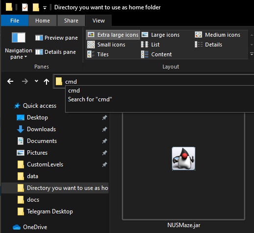
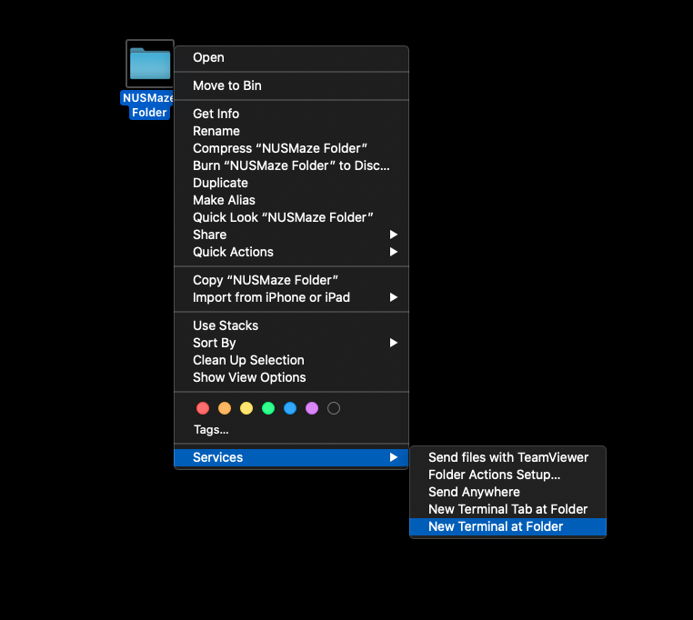
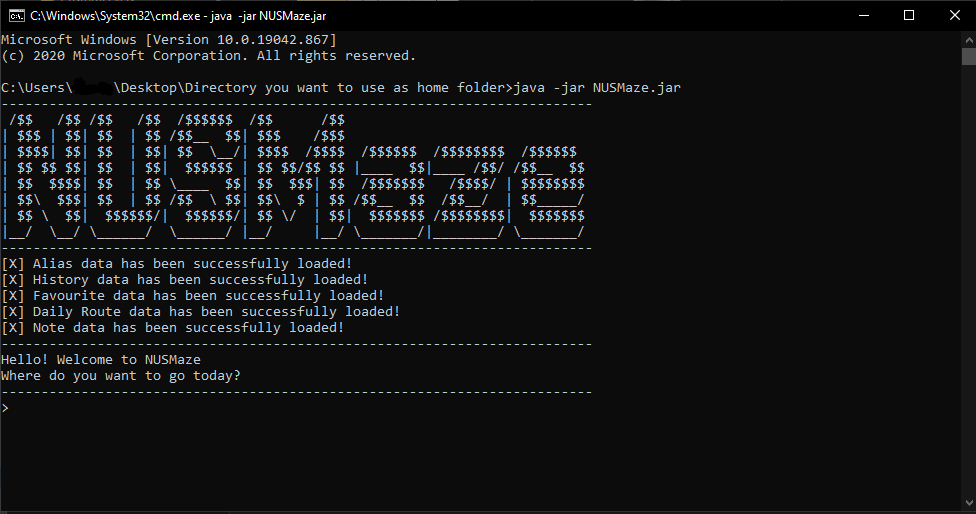

# User Guide for NUSMaze

## Table of Contents
1. [Introduction](#1-introduction) <br>
2. [Quick start](#2-quick-start) <br>
3. [About](#3-about) <br>
   3.1. [Structure of this document](#31-structure-of-this-document) <br>
   3.2. [Reading this document](#32-reading-this-document) <br>
   &nbsp;&nbsp;&nbsp;&nbsp; 3.2.1. [General Symbols and Syntax](#321-general-symbols-and-syntax) <br>
   &nbsp;&nbsp;&nbsp;&nbsp; 3.2.2. [Format of commands](#322-format-of-commands) <br>
   &nbsp;&nbsp;&nbsp;&nbsp; 3.2.3. [Technical terms](#323-technical-terms) <br>
4. [Features](#4-features)  <br>
   4.1. [Viewing Help](#41-viewing-help)<br>
   4.2. [Routing](#42-routing) <br>
   &nbsp;&nbsp;&nbsp;&nbsp; 4.2.1. [Routing between blocks](#421-routing-between-blocks) <br>
   &nbsp;&nbsp;&nbsp;&nbsp; 4.2.2. [Routing to the closest eatery](#422-routing-to-the-closest-eatery) <br>
   4.3. [History](#43-history) <br>
   &nbsp;&nbsp;&nbsp;&nbsp; 4.3.1. [Viewing History](#431-viewing-history) <br>
   &nbsp;&nbsp;&nbsp;&nbsp; 4.3.2. [Clearing History](#432-clearing-history) <br>
   &nbsp;&nbsp;&nbsp;&nbsp; 4.3.3. [Repeating History](#433-repeating-history) <br>
   4.4. [Alias](#44-alias) <br>
   &nbsp;&nbsp;&nbsp;&nbsp; 4.4.1. [Adding an alias for block name](#441-adding-an-alias-for-block-name) <br>
   &nbsp;&nbsp;&nbsp;&nbsp; 4.4.2. [Viewing all aliases](#442-viewing-all-aliases) <br>
   &nbsp;&nbsp;&nbsp;&nbsp; 4.4.3. [Deleting aliases](#443-deleting-aliases) <br>
   4.5. [Daily Routes](#45-daily-routes) <br>
   &nbsp;&nbsp;&nbsp;&nbsp; 4.5.1. [Adding a daily route](#451-adding-a-daily-route) <br>
   &nbsp;&nbsp;&nbsp;&nbsp; 4.5.2. [Viewing daily route](#452-viewing-daily-route) <br>
   4.6. [Notes](#46-notes) <br>
   &nbsp;&nbsp;&nbsp;&nbsp; 4.6.1 [Adding notes](#461-adding-notes) <br>
   &nbsp;&nbsp;&nbsp;&nbsp; 4.6.2. [Viewing notes](#462-viewing-notes) <br>
   &nbsp;&nbsp;&nbsp;&nbsp; 4.6.3 [Delete note](#463-delete-note) <br>
   4.7. [Favourite Routes](#47-favourite-routes) <br>
   &nbsp;&nbsp;&nbsp;&nbsp; 4.7.1 [Adding Favourite route](#471-adding-favourite-route) <br>
   &nbsp;&nbsp;&nbsp;&nbsp; 4.7.2. [Show stored favourites](#472-show-stored-favourites) <br>
   &nbsp;&nbsp;&nbsp;&nbsp; 4.7.3 [Repeating favourite route](#473-repeating-favourite-route) <br> 
   &nbsp;&nbsp;&nbsp;&nbsp; 4.7.4 [Deleting favourite route](#474-deleting-favourite-route) <br>
   4.8. [Exiting the application](#48-exiting-the-application) <br>
   4.9. [Saving the Data](#49-saving-the-data) <br>
5. [FAQ](#5-faq) <br>
6. [Glossary](#6-glossary) <br>
7. [Command summary](#7-command-summary) <br>


## 1. Introduction

Welcome to the User Guide of **NUSMaze**!

**NUSMaze** is a Command Line Interface (CLI) based application that aims to **simplify NUS
Computer Engineering students’ journey** from one point to another within the NUS
Engineering and Computing buildings. The application allows users to find the shortest route
from one block to another, locate the nearest eatery, add personal notes to the location and
many more.

The application uses a Command Line Interface (CLI); this means that you operate the application by typing commands
into a Command Box. If you are fast at typing, you can operate the application faster than other Graphical User Interface
(GUI) applications; GUI applications allow users to interact with the application through graphical icons such as buttons.

This user guide will take you through how various features of the NUSMaze can be utilised, all
geared towards providing the best possible experience to the user.

If you are interested, jump to [Section 2 - Quick Start](#2-quick-start) to learn how to start find your way through school with **NUSMaze**.

--------------------------------------------------------------------------------------------------------------------

## 2. Quick start

This section gives you step-by-step instructions on how to download and open the application.

1. Ensure you have Java `11` or above installed in your Computer. You may install it [here](https://www.oracle.com/java/technologies/javase-jdk11-downloads.html).

2. Download the latest `NUSMaze.jar` [here](https://github.com/AY2021S2-CS2113T-T09-2/tp/releases).

3. Copy the file to the folder you want to use as the _home folder_ **NUSMaze**.

4. Open your command line or terminal and navigate into the file directory where you saved the application. <br>
:information_source: An easy way to do so is shown below for both Mac and Windows<br>
    <br>
   Press enter on Windows or click on "New Terminal at Folder" on Mac to launch the command line or terminal<br>
5. Key in `java -jar NUSMaze.jar` and press enter to launch the NUSMaze application.<br>
6. A CLI similar to Figure 1 below should appear in a few seconds.  <br>
   
   _Figure 1 - CLI of NUSMaze_

7. Type your command into the command box at the bottom of the screen, and press `Enter` on your keyboard to execute it. E.g. typing `help` and pressing `Enter` will open a help window.<br>

8. Refer to [Section 4 - Features](#4-features) for details on the commands you can use for each feature. <br> <br>


--------------------------------------------------------------------------------------------------------------------
## 3. About

### 3.1. Structure of this document

We have structured this User Guide in a way to help you find what you need easily and quickly.
In the next subsection, [Section 3.2 - reading this document](#32-reading-this-document), you can find several useful tips on how to read this guide.
The following section, [Section 4 - Features](#4-features), documents the seven main features in **NUSMaze**, namely:


### 3.2. Reading this document

This section introduces you to some technical terms, symbols and syntax that are used throughout the guide. You may want to
familiarize yourself with them before moving to the next section.


#### 3.2.1. General Symbols and Syntax

The table below explains the general syntax used throughout the user guide.

| Syntax |  What it means |
|----------|-------------|
| `command` |  A grey highlighted block specifies a executable command that can be entered into the command box.  |
| _italics_ | Italicised text indicates that the text has a definition specific to NUSMaze, or it is a caption for a Figure in the guide. |
|<div markdown="block" class="alert alert-info"> :information_source: </div>  | An exclamation mark indicates that the following text is a tip. |
|<div markdown="block" class="alert alert-danger"> :warning: </div> | A warning sign indicates that the following text is important. |

#### 3.2.2. Format of commands
The following points explain the format of a command.
More examples will be provided for each command in [Section 4 - Features](#4-features).

1. Words in Upper_Case are parameters to be supplied by you.
   <br/>Eg. in add note LOCATION/DESCRIPTION, LOCATION and DESCRIPTION are parameters which can be used as add note E1/CS2113T.

2. In all formats shown in features, → denotes a prompt from the CLI. A user input is expected after the prompt.

3. All the examples provided below are simulation scenarios of expected user commands and outputs by NUSMaze.

4. In each example, lines starting with > signifies user command.

5. In each example, lines starting with * signifies a user input after being prompted by NUSMaze.

#### 3.2.3. Technical terms

The table below explains some technical terms that you may come across throughout the user guide.

| Term |  What it means |
|----------|-------------|
| CLI |  The Command-Line Interface (or CLI for short) is the user interface in which NUSMaze is based on. Unlike traditional Graphical User Interface (GUI) base applications, it may be less intuitive to new users. However upon familiarisation, fast typists may find it faster to use.  |
| Command word| The Command word refers to the keywords which NUSMaze recognises to invoke specific commands. These command words will be indicated by `COMMAND WORD` in the various sections below.|

--------------------------------------------------------------------------------------------------------------------

## 4. Features

This section contains all the information about the features of **NUSMaze**.
You may enter a command into the _CLI_ to use each feature.

### 4.1 Viewing Help

Lists all commands and functions of each feature.<br>
Format: `help`

### 4.2 Routing

#### 4.2.1 Routing between blocks

Finds the shortest route to go from one block to another.<br>
Format: `go` → `STARTING_BLOCK` → `DESTINATION BLOCK`
Example:
```
------------------------------------------------------------------------------------------------------------
> go
------------------------------------------------------------------------------------------------------------
Starting Block:
* e2
  Destination Block:
* com1
------------------------------------------------------------------------------------------------------------
Route: E2 -> E3 -> E4 -> E5 -> LT3 -> CHINESE LIBRARY -> CENTRAL LIBRARY -> AS6 -> COM1
------------------------------------------------------------------------------------------------------------
```
- When the `go` command is given NUSMaze will prompt you for the `STARTING_BLOCK`
  followed by the `DESTINATION BLOCK`.
  
:warning: Both parameters must be one of the Engineering or Computing buildings.

#### 4.2.2 Routing to the closest eatery
It is also possible to find the closest eatery using the go feature.<br>
Format 1: `go` → `STARTING_BLOCK` → `EATERY_NAME`
- By entering the name of the eatery that you wish to go in the `EATERY_NAME` parameter,
  NUSMaze will display the shortest route to go from the `STARTING_BLOCK` to the
  desired eatery.

Format 2: `go` → `STARTING_BLOCK` → `eatery` → `EATERY_NAME`
- It is also possible to see the list of Eateries, from closest to furthest by entering eatery
  when NUSMaze prompts for the destination block.

- When NUSMaze prompts for entry to the eatery, you can enter `EATERY_ENTRY` that you
  wish to go.

- `EATERY_ENTRY` must be an integer from 1 to 5.


### 4.3 History
#### 4.3.1 Viewing History

Lists the past 10 route searches.<br>
Format : `history`

#### 4.3.2 Clearing History

Deletes all histories (past route searches).<br>
Format : `clear history`

#### 4.3.3 Repeating History

Repeats past route search history.<br>
Format : `repeat history` → `REPEAT_ENTRY`
- When the repeat command is entered, NUSMaze will show a list of past route searches.

- Followed by a prompt asking for the `REPEAT_ENTRY` index that you want to repeat.

- `REPEAT_ENTRY` must be an integer number within the numbered list.

### 4.4 Alias
#### 4.4.1 Adding an alias for block name
Creates an alias for existing blocks.<br>
Format : `add alias` → `BLOCK` → `ALIAS_NAME`
- When add alias command is called, NUSMaze will prompt for the `BLOCK` that you
  wish to set the alias for.

- NUSMaze then prompts you to input a desired `ALIAS_NAME`.

- Note that there cannot be multiple blocks sharing the same alias.

#### 4.4.2 Viewing all aliases
Lists all aliases that are currently active.<br>
Format : `show alias`

#### 4.4.3 Deleting aliases
Deletes an alias that was previously created.<br>
Format : `delete alias` → `ALIAS_NAME`
- When the `delete alias` command is given, NUSMaze will prompt you for the
  `ALIAS_NAME` that you wish to delete.

### 4.5 Daily Routes
#### 4.5.1 Adding a daily route
Adds a schedule for the selected day.<br>
Format : `add daily route` → `DAY_ENTRY` → `BLOCK/END`
Example :
```
------------------------------------------------------------------------------------------------------------
> add daily route
------------------------------------------------------------------------------------------------------------
Here are the available days:
1. MONDAY
2. TUESDAY
3. WEDNESDAY
4. THURSDAY
5. FRIDAY
6. SATURDAY
7. SUNDAY
------------------------------------------------------------------------------------------------------------
Select entry:
* 1
------------------------------------------------------------------------------------------------------------
Enter location of the first activity of the day: 
* e2
Enter location of the next activity of the day: 
* e7
Enter location of the next activity of the day: 
* ea
Enter location of the next activity of the day: 
* end
------------------------------------------------------------------------------------------------------------
Got it! Successfully added MONDAY's schedule!
------------------------------------------------------------------------------------------------------------
```
- You will be prompted to select the `DAY_ENTRY` of the day which you want to schedule.

- You will then be prompted to enter the location of the activities(`BLOCK`) of the day one at
  a time.

- NUSMaze will continuously ask for locations until you input `END`.

:warning: `DAY_ENTRY` must be an integer between 1 and 7, each representing a day of the week
(1 represents Monday and 7 represents Sunday).

:warning: There must be at least one block entered for the schedule.

#### 4.5.2 Viewing daily route
Shows the generated route for the schedule of the selected day, if applicable.<br>
Format : `show daily route` → `DAY_NUMBER`
Example :
```
------------------------------------------------------------------------------------------------------------
> show daily route
------------------------------------------------------------------------------------------------------------
Here are the available days:
1. MONDAY
2. TUESDAY
3. FRIDAY
------------------------------------------------------------------------------------------------------------
Select entry:
* 1
------------------------------------------------------------------------------------------------------------
Location of activity 1: E2

Location of activity 2: E7
Route: E2 -> E3 -> E4 -> E4A -> EW2 -> E6 -> E7

Location of activity 3: EA
Route: E7 -> E6 -> EW2 -> E4A -> E4 -> E3 -> E2 -> EA
------------------------------------------------------------------------------------------------------------
```
- When the day command is entered, the application will display the list of available days
  for which daily routes have been saved.

- NUSMaze will then prompt you for a `DAY_NUMBER`.

:warning: The `DAY_NUMBER` must be the index of one of the available days which has been
  displayed.

#### 4.5.3 Clearing daily route
Clears the schedule of the selected day, if applicable.<br>
Format : `delete daily route` → `DAY_NUMBER`
Example :
```
------------------------------------------------------------------------------------------------------------
> delete daily route
------------------------------------------------------------------------------------------------------------
Here are the available days:
1. MONDAY
2. TUESDAY
3. FRIDAY
------------------------------------------------------------------------------------------------------------
Select entry:
* 1
------------------------------------------------------------------------------------------------------------
Got it! Successfully cleared MONDAY's schedule!
------------------------------------------------------------------------------------------------------------
```
- When the day command is entered, the application will display the list of available days
  for which daily routes have been saved.

- NUSMaze will then prompt you for a `DAY_NUMBER`.

:warning: The `DAY_NUMBER` must be the index of one of the available days which has been
  displayed.

### 4.6 Notes
#### 4.6.1 Adding notes
Tags a note to a particular existing location of your choice.<br/>
Format : `add note`  → `LOCATION` → `NOTE`
- When the 'add note' command is given, NUSMaze will prompt you for a `LOCATION`.
- The `LOCATION` must be one of the Engineering or Computing buildings.
- After a valid location is keyed in,  NUSMaze will prompt you for a `NOTE` to be tagged to the location.

#### 4.6.2 Viewing notes
Lists all notes which had been tagged to the given existing location, if applicable.<br/>
Format : `show notes` → `LOCATION`
- When the 'list notes' command is entered, NUSMaze will prompt you for a `LOCATION`.

- The `LOCATION` must be one of the Engineering or Computing buildings.

#### 4.6.3 Delete note
Delete the specified note based on index number tagged to the given existing location.<br/>
Format : `delete note` → `LOCATION` → `NOTE INDEX`
- When the 'delete note' command is entered, NUSMaze will then prompt you for a `LOCATION`.

- The `LOCATION` must be one of the Engineering or Computing buildings.

- After a valid location is keyed in,  NUSMaze will prompt you for a `NOTE INDEX` of the note to be deleted,
  which is the index of the note in the location's notes list.

- The `NOTE INDEX` must be an integer within the total number of notes that the location has.

### 4.7 Favourite Routes
#### 4.7.1 Adding Favourite Route
You can add a route to favourites to easily access it in the future.<br>
Format : `add favourite` → `STARTING BLOCK` → `DESTINATION BLOCK`

#### 4.7.2 Show stored favourites
You can request NUSMaze to display all the saved favourites, if you have stored at least one route to favourites.<br>
Format : `show favourite`

#### 4.7.3 Repeating favourite route
You can execute and obtain the route to take for your favourite routes.<br>
Format : `repeat favourite` → `INDEX OF ROUTE`

#### 4.7.4 Deleting favourite route
You can delete a favourite route if it is not frequently used anymore.<br>
Format : `delete favourite` → `INDEX OF ROUTE`

### 4.8 Exiting the application

Exits the application.<br>
Format : `bye`

### 4.9 Saving the Data

NUSMaze data is saved in the hard disk automatically after any command that changes the data. There is no need to save manually.

--------------------------------------------------------------------------------------------------------------------

## 5. FAQ

**Q**: Do I lose all my personalised routes and preferences when i close the application? <br>
**A**: Aliases, daily scheduled routes, history and notes are all stored once you exit the app and loaded upon next entry so you do not lose any data.

**Q**: How do I transfer my personalised routes and preferences to another computer? <br>
**A**: Copy the entire data folder that can be found together with the NUSMaze.jar file on the first computer and copy it over to the same directory where the NUSMaze.jar file
can be found on the second computer.


--------------------------------------------------------------------------------------------------------------------

## 6. Glossary

* **Alphanumeric**: Alphanumeric does not include special characters, it only includes letters a to z (uppercase and lowercase) and digits 0 to 9.
* **Special Characters**: Refers to any of the characters within these set of characters: +!#$%&'*+/=?\`{}~^.-&#124;

--------------------------------------------------------------------------------------------------------------------

## 7. Command summary

|Action | Format |
|---------------|------------------------------------------------------------------|
|[**Viewing help**](#41-viewing-help)        | `help` | 
|[**Finding the route**](#42-routing)       | `go → START → DESTINATION` or `go → START → eatery → EATERY_ENTRY` |
|[**Viewing history**](#431-viewing-history)     | `history` | 
|[**Clearing history**](#432-clearing-history)       | `clear history` |
|[**Repeating history**](#433-repeating-history)       | `repeat history → REPEAT_ENTRY` |
|[**Adding alias for block names**](#441-adding-an-alias-for-block-name)| `add alias → BLOCK → ALIAS`| 
|[**Showing all aliases**](#442-viewing-all-aliases)  | `show alias` | 
|[**Deleting alias**](#443-deleting-aliases)       | `delete alias → ALIAS` |
|[**Adding a daily route**](#451-adding-a-daily-route)     | `add daily route → DAY_NUMBER → BLOCK → … → BLOCK → END` | 
|[**Showing a daily route**](#452-viewing-daily-route)       | `show daily route → DAY_NUMBER` |
|[**Clearing a daily route**](#453-clearing-daily-route)       | `clear daily route → DAY_NUMBER` |
|[**Adding notes**](#461-adding-notes)       | `add note → LOCATION → NOTE` |
|[**Viewing notes**](#462-viewing-notes)      | `show notes → LOCATION`| 
|[**Deleting notes**](#463-delete-note)       | `delete note → LOCATION → NOTE INDEX` |
|[**Adding Favourite Route**](#471-adding-favourite-route)       | `add favourite → STARTING BLOCK → DESTINATION BLOCK` |
|[**Show stored favourites**](#472-show-stored-favourites)       | `show favourite` |
|[**Repeating favourite route**](#473-repeating-favourite-route)       | `repeat favourite → INDEX OF ROUTE` |
|[**Deleting favourite route**](#474-deleting-favourite-route)       | `delete favourite` |
|[**Exiting the application**](#48-exiting-the-application)       | `bye` |

